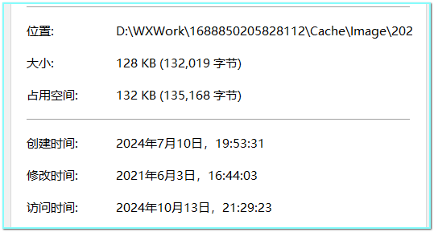

[TOC]

---

# WXWork-Tool

企业微信工具。

因为企微为了工作的原因，会设置自动下载文件，会导致本地缓存的文件较大。这里提供一些工具用于处理这些重复的文件（一开始人为删除，感觉比较麻烦，而且晃眼，于是想通过程序来处理）。

## 说明

**部分逻辑会直接删除文件，为防止误删，操作前请进行备份，数据无价**。

同时，涉及到**删除**操作的，不递归处理，目录写死，有需要的自定修改目录(`directory`)，防止误删数据。

注意：大部分只处理本地文件，不保证企微能够正常显示对于的聊天记录。（适用场景参考：离职后，想备份本地文件，但是发现很多重复的。）

## 图片相关工具--done

图片路径：WXWork安装目录\企业id\Cache\Image

例如：D:\WXWork\1688850205828112\Cache\Image\2023-10

> 一开始尝试询问pgt的问题（注意不要完全相信它！！），仅供参考：
>
> python 遍历目录下的文件：D:\WXWork\1688850205828112\Cache\Image\2023-11，如果是png，判断是否有同名的jpg图片，如有，打印jpg照片名称；如有类似(1)括号里面是数字这样的文件名，查找是否有类型的没有括号的文件名，如有，打印。
>
> python 遍历目录下的文件：D:\WXWork\1688850205828112\Cache\Image\2023-11，如果是png，判断是否有同名的jpg图片，如有，打印jpg照片名称，并删除jpg图片；如有类似(1)括号里面是数字这样的文件名，查找是否有类型的没有括号的文件名，如有，打印带括号的文件名，并删除带括号的jpg图片。

### 工具1：删除小于15kb的图片(把它当做是表情包)

据我观察，发现企微的表情包好像就是图片来的，也就是说和普通的文件很难区分。

因此，这里取巧了，我把这类很小的图片归结为表情包。

以及其他文件，比如：

```
1363bb78-9fed-4e6c-b7f1-f29be6984609.png; charset=UTF-8
dffe7656-d69b-4564-a8f8-ac79ef6a5e43.jpeg; charset=UTF-8

1c4f8b70-70f2-4224-85fc-8c2154a75ed8.png
1c4f8b70-70f2-4224-85fc-8c2154a75ed8_5_0.0.896.381_550_237.png

ed41492e-2318-4424-8b4e-4a4233606b06.png
ed41492e-2318-4424-8b4e-4a4233606b06_5_0.0.1065.453_550_237.png
```

参考路径：D:\WXWork\1688850205828112\Cache\Image\2023-10

#### 使用工具示例

```shell
cd D:\WXWork\1688850205828112\Cache\Image\2023-10
sh 1_remove_emoji.sh
```

### 工具2：删除带括号的重复图片

图片重复的方式如下：

c0727119-53d8-415b-9f7a-d635c62817ba.jpg 
c0727119-53d8-415b-9f7a-d635c62817ba(1).jpg 重复

猜测成因：同一张照片，发到不同的聊天（不同人或者是不同的群），导致出现了重复。

**处理规则：**

1. 查找带括号的文件，是否同时存在去掉括号之后的文件。
2. 找到后，比较两个文件的大小，删除空间比较小的那个（其实偏向于删除有括号的文件）。

#### 使用工具示例

修改2_remove_dupicate_has_brackets.py中的目录`directory`

```shell
py 2_remove_duplicate_has_brackets.py
```

### 工具3：删除名称重复的图片(png的重复图片jpg)

名称重复，但是后缀不同；原图是png，会重复生成一张jpg。图片重复方式如下：

```
企业微信截图_17131484238.png，989 KB
企业微信截图_17131484238.jpg，54.4KB
```

**处理规则：**

1. 查找png，是否同时存在同名的jpg。
2. 找到后，比较两个文件的大小，删除空间比较小的那个。

#### 使用工具示例

修改3_remove_duplicate_name_jpg.py中的目录`directory`

```shell
py 3_remove_duplicate_name_jpg.py
```

### 工具4：删除内容重复的图片

说实话这种是挺麻烦的，内容看起来完全一样，但是名称却完全不一样！！！处理起来比较麻烦。

**处理规则：**

1. 利用hash判断文件内容是否重复。
2. 找到后，比较两个文件的创建时间，删除创建时间比较晚的那个。

#### 使用工具示例

修改4_remove_duplicate_content_pic.py中的目录`directory`

```shell
py 4_remove_duplicate_content_pic.py
```

## 文件相关工具--doing

参考图片相关逻辑进行处理。

### 工具1：删除特殊文件

编辑中的文档会自动生成带特殊前缀的中间文件，例如：`~$11.docx`。

比如：

```
11.docx 
编辑中的文件 
~$11.docx
```

参考路径：D:\WXWork\1688850205828112\Cache\File\2023-10

#### 使用工具示例

```shell
py utils/file_utils.py
```

### ~~工具2：删除带括号的重复图片~~

### ~~工具3：删除名称重复的图片(png的重复图片jpg)~~

### 工具4：删除内容重复的文件

说实话这种是挺麻烦的，内容看起来完全一样，但是名称却完全不一样！！！处理起来比较麻烦。

**处理规则：**

1. 利用hash判断文件内容是否重复。
2. 找到后，查看是否有常见副本的关键字，如有进行删除。
3. 如果都没有关键字，比较两个文件的创建时间(或者修改时间)，删除创建时间比较晚的那个。

#### 使用工具示例

修改utils/file_utils.py中的目录`directory`

```shell
py utils/file_utils.py
```

#### 注意：文件时间问题

之前忽略了一个问题，正常来说创建时间是会比修改时间比较早的。

但是**复制**会导致**创建时间比修改时间晚**，如下图所示：



因此在判断文件先后顺序时需要多考虑一步：

- 如果文件**创建时间<=修改时间**，按照**创建时间**来比较，删除后面的文件。

- 如果文件**创建时间>=修改时间**，按照**修改时间**来比较，删除后面的文件。

## License

[MIT License](./LICENSE.txt)

